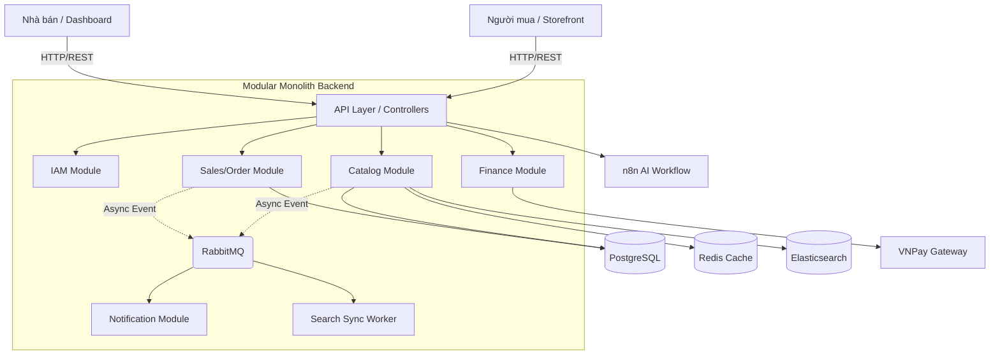

# Phân Tích Kiến Trúc Toàn Diện Chuyên Sâu (Bản Tổng Hợp & Đánh Giá Lỗ Hổng) - Omni Marketplace

> [!NOTE]
> Đây là bản Báo Cáo Tổng Hợp Siêu Chi Tiết (Mega-Document). Nó tuân thủ chặt chẽ 13 mục phân tích kiến trúc, lý do chọn công nghệ, và **đặc biệt bổ sung các phát hiện chí mạng về lỗ hổng bảo mật, N+1 Query, và Fake Analytics** được tìm thấy sau quá trình rà soát code kỹ lưỡng.

---

## 1. NHẬN DIỆN DỰ ÁN

| Tiêu chí | Mô tả chi tiết |
| :--- | :--- |
| **Loại hệ thống** | Sàn thương mại điện tử đa nhà bán (Multi-Vendor E-commerce Platform). |
| **Mô hình kinh doanh** | **B2B2C** (Business-to-Business-to-Consumer) - Nền tảng kết nối người bán (Vendor) và người mua cuối (Consumer) tương tự Shopee, Tiki. |
| **Thành phần chính** | **1. Omni Storefront:** Next.js App cho người mua hàng (Web).<br>**2. Omni Dashboard:** React/Vite SPA cho Nhà bán hàng (Vendor) và Admin quản lý.<br>**3. Omni Backend Core:** Core API bằng Spring Boot xử lý toàn bộ logic nghiệp vụ. |
| **Đối tượng người dùng** | Customer (Mua hàng), Vendor (Bán hàng), Admin (Quản trị), System/AI n8n (Hỗ trợ tự động). |

---

## 2. KIẾN TRÚC TỔNG THỂ

### 2.1. Mô hình: Modular Monolith kết hợp Hexagonal Architecture
Dự án áp dụng mô hình **Modular Monolith** kết hợp **Hexagonal Architecture (Ports & Adapters)**.
- **Điểm mạnh:** Separation of concern rõ ràng giữa domain objects và JPA entities. Tránh được sự phức tạp của Microservices nhưng vẫn giữ được code sạch để chia tách sau này.
- **Điểm yếu (Anti-patterns phát hiện được):**
  - **Domain Layer rỗng:** Thư mục `catalog/domain/` trống rỗng, vi phạm nguyên tắc DDD (Domain-Driven Design).
  - **Tight coupling:** `OrderService` import trực tiếp JPA entity thay vì thông qua ports (interfaces), vi phạm nguyên tắc cốt lõi của Hexagonal Architecture.

### 2.2. Sơ đồ luồng dữ liệu logic


---

## 3. HẠ TẦNG & DEPLOYMENT

- **Môi trường triển khai:** Dự án đóng gói bằng **Docker Compose** với Postgres, Redis, RabbitMQ, Elasticsearch, MinIO, Zipkin, Prometheus, n8n.
- **Rủi ro rò rỉ & Sai sót cấu hình (CRITICAL):**
  - **Thiếu Health Checks:** Elasticsearch, RabbitMQ, n8n hoàn toàn không có `healthcheck` config. Nếu ES chưa sẵn sàng, backend sẽ crash ngay khi khởi động.
  - **Hardcode Credentials:** Mật khẩu DB (`omni_password`) và n8n admin (`omni_n8n_2024`) bị hardcode thẳng vào docker-compose và `.env.example`.
  - **Thiếu Resource Limits:** Hệ thống không giới hạn CPU/RAM cho các container (`deploy.resources`). Elasticsearch có thể gây OOM (Out-of-memory) kéo sập Database.

---

## 4. DATABASE & DATA LAYER (Tầng Dữ Liệu)

### 4.1. PostgreSQL 16 (Core DB) & JSONB
- **Lý do chọn:** Thay vì EAV Pattern nối bảng chậm chạp, hệ thống dùng **JSONB** của Postgres để lưu thuộc tính động (Ví dụ: `payload JSONB NOT NULL` trong bảng `delayed_jobs`).

### 4.2. Chống Double-Charge (Idempotency)
- Team đã thiết kế cấu trúc chống lỗi thanh toán 2 lần ở ngay tầng DB:
  ```sql
  ALTER TABLE parent_orders ADD COLUMN idempotency_key VARCHAR(255) UNIQUE;
  ```

### 4.3. Rủi ro Data Layer
- **Thiếu Index:** Không thấy index định nghĩa cho các foreign keys rất phổ biến như `child_orders.shop_id`, `order_items.product_id` (Dù đã có V42 khắc phục một phần).
- **Coupling bên thứ 3:** Bảng `UserAddress` lưu trực tiếp `ghnDistrictId`, `ghnWardCode` - làm data domain bị dính chặt với GHN.

---

## 5. BACKEND / API (Spring Boot 3)

### 5.1. Rủi ro Bảo Mật Cực Kỳ Nghiêm Trọng (CRITICAL SECURITY BUGS)
> [!CAUTION]
> Qua quá trình soi code, hệ thống dính các lỗi bảo mật có thể gây thiệt hại tài chính lập tức:
> 1. **VNPay & GHN Webhook không xác thực chữ ký:** Endpoint `/api/payment/vnpay/ipn` và `/api/webhook/ghn` đang để public. Bất kỳ hacker nào cũng có thể gọi API này để giả mạo giao dịch thanh toán thành công.
> 2. **Fallback JWT Secret:** File `application.yml` có chứa fallback secret key hardcode. Hacker có thể dùng key này để tự ký JWT token giả mạo làm Admin.
> 3. **Bypass Rate Limit:** `RateLimitFilter` đọc thẳng IP từ `X-Forwarded-For` bằng cách `split(",")[0]` mà không sanitize, dễ dàng bị spoofing (giả mạo IP).

### 5.2. Điểm Nghẽn Hiệu Năng (CRITICAL BOTTLENECKS)
> [!WARNING]
> Backend chứa các Anti-patterns sẽ làm hệ thống OOM ngay lập tức khi tải tăng:
> 1. **God Service & N+1 Query:** `OrderService` dài 542 dòng. Khi thống kê doanh thu, nó load TOÀN BỘ đơn hàng của shop vào RAM (`childOrderRepository.findByShopId`) rồi mới filter/sum bằng Java Stream, thay vì dùng truy vấn SQL `SUM(...)`.
> 2. **`findAll()` trong Scheduler:** Hàm `autoCancelPendingOrders()` gọi `parentOrderRepository.findAll()` để quét DB mỗi 5 phút. Khi DB có 100.000 đơn hàng, RAM server sẽ nổ tung. Cần thay bằng JPQL `@Query` với `LIMIT`.

### 5.3. Sai Lệch Business Logic (Fake Analytics)
- Bất ngờ nhất là trong `OrderService`, các chỉ số Analytics đang bị **Làm Giả (Fake)** bằng công thức hardcode thay vì tracking thực tế:
  ```java
  int pageViews = ordersPlaced * 85 + 124;   // ← GIẢ MẠO
  ```
  Điều này sẽ dẫn đến sai lệch hoàn toàn quyết định kinh doanh của các Vendor.

### 5.4. Lỗi Phiên bản & Xử lý Exception
- **Java Version Mismatch:** `pom.xml` khai báo `<java.version>17</java.version>` nhưng `maven-compiler-plugin` lại target `21`. Dễ gây lỗi build trên CI.
- **Xử lý Error Code sai:** Dùng `throw new RuntimeException("Unauthorized")` khiến Spring Boot trả về lỗi HTTP 400 (Bad Request) thay vì HTTP 403 (Forbidden) hoặc 401.

---

## 6. FRONTEND (Next.js & Vite)

### 6.1. Kiến trúc phân tách
- **Storefront (Next.js 16):** Khách mua hàng cần **SEO**, Next.js trả về SSR HTML giúp Google Bot quét dễ dàng.
- **Dashboard (Vite + React 19):** Admin/Vendor cần tương tác SPA mượt mà, dùng Vite build cực nhanh kết hợp TanStack Query.

### 6.2. Lỗi dư thừa State (Redundancy)
- Quá trình audit chỉ ra rằng Token đang được lưu ở **cả 2 nơi**: Trong Zustand store (dùng `persist` middleware) VÀ trong `localStorage` thủ công. Điều này gây dư thừa và rủi ro out-of-sync dữ liệu.
- Project Dashboard đang dùng `TypeScript ~6.0.2` (Bản Nightly/Pre-release), cực kỳ rủi ro cho Production. Cần downgrade về `^5.x`.

---

## 7. TÍCH HỢP BÊN NGOÀI (3RD PARTY)

- **n8n (AI Workflow Orchestration):**
  - **Lý do chọn thông minh:** Tách bạch logic xử lý AI Chatbot ra khỏi Java core. Kỹ sư có thể lên giao diện n8n đổi Prompt mà không cần Redeploy backend.
  - **Lỗ hổng (SSRF & DDoS):** API `/api/public/ai-chat/anonymous` không bắt đăng nhập, cũng không có Rate limit theo IP chặt chẽ. Dễ bị spam làm cạn kiệt API Credit của Gemini/OpenAI. Thêm nữa, `AiChatService` có timeout lên tới 65 giây (blocking thread).

---

## 8. KẾ HOẠCH TRIỂN KHAI & ĐÁNH GIÁ TỔNG THỂ

### 8.1. Các việc ưu tiên P0 (Làm ngay lập tức)
1. Bổ sung hàm Verify HMAC Signature cho webhook VNPay và GHN.
2. Sửa lệnh `findAll()` trong các Schedulers và đổi các hàm tính Sum doanh thu sang dùng JPQL.
3. Chuyển File Upload từ Local (`/uploads`) sang thẳng CDN/S3 qua cơ chế Pre-signed URL để tránh rủi ro bảo mật Path Traversal và nghẽn băng thông.
4. Xóa ngay công thức Fake Analytics trong `OrderService`.

### 8.2. Điểm Số Tổng Thể

Dự án sở hữu ý tưởng thiết kế **rất tốt** (Event-driven, CQRS qua ES, n8n proxy) nhưng **khâu thực thi (Implementation) lại mắc nhiều lỗi chí mạng** về bảo mật và tối ưu hóa bộ nhớ.

- **Kiến trúc tổng thể:** 8.0/10 (Hexagonal đúng hướng nhưng domain rỗng).
- **Tính năng / MVP:** 8.5/10 (Đầy đủ chức năng, AI Chat rất sáng tạo).
- **Bảo mật & Hiệu năng:** 4.5/10 (Webhook hớ hênh, `findAll` gây OOM).
- **Chất lượng Code:** 6.0/10 (God object `OrderService`, Exception handling sai).

**ĐIỂM TỔNG KẾT: 6.5 / 10.** 
*Hệ thống CẦN ĐƯỢC REFACTOR NGAY LẬP TỨC các lỗi P0 (Security & OOM) trước khi dám mở Public cho khách hàng thật.*
